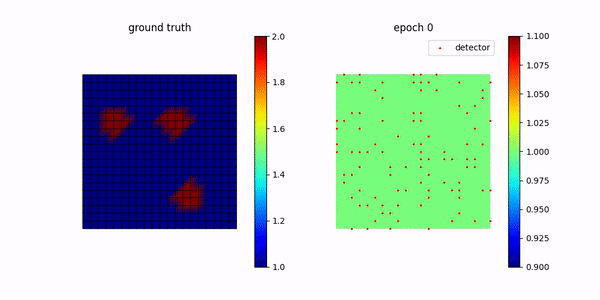

# PBS_project
Differentiable Physics Solver

## Experiment 1 - Defect Monitoring

### Description

In this approach, we develop a fully-differentiable finite element method (FEM) solver based on automatic differentiation from scratch (totally by ourselves) in PyTorch for solving inverse problems in wave equations. The inverse problem is the detection of a defect in a plate using sparse sensor data. 

### Problem Setups

Here, we consider a simplified model: a 2D wave equation. To set up a problem for solving the inverse problem using a 2D wave equation, we'll follow a simplified approach, appropriate for a basic example. The 2D wave equation you provided is:

$$\frac{\partial^2 u}{\partial t^2} = c(x,y)^2 \Delta u$$

where $u$ is the wave function, $c$ is the wave speed, and the equation describes the propagation of a wave in a two-dimensional medium. 

**Defect Modeling**

In the uniform medium, the $c$ will be constant throughout the medium. To simulate defects, we assume the wave speed in certain regions is 2 (defects) and 1 for other regions.

**Discretization**

- *Spatial Discretization*: we use the structured quadrilateral mesh to discretize our solution domain.
- *Temporal Discretization*:  We use the Crank-Nicolson time-stepping scheme for the conservation of total energy.

$$\mathbf{M}{\frac{d^2 \mathbf{U}(t)}{dt^2}+\mathbf{A}\mathbf{U}(t)=0}$$

$$\mathbf{M}\frac{\mathbf{U}(j+1)-2\mathbf{U}(j)+\mathbf{U}(j-1)}{\tau^2}=-\mathbf{A}\mathbf{U}(t),\ j=0,1,2,\dots$$

where $\mathbf{U}(t)$ is the discretized degree of freedom for the continuous solution domain. For $\mathbf{U}(-1)$, we can use the initial condition to derive: 

$$\frac{d\mathbf{U}(0)}{dt}=\mathbf{V}(0) \Rightarrow \frac{\mathbf{U}(1)-\mathbf{U}(-1)}{2\tau} = \mathbf{V}(0)$$

- The stability of the simulation often depends on the relation between $\delta x$ and $\tau$, typically governed by the Courant–Friedrichs–Lewy (CFL) condition.

**Initial and Boundary condition**

To best simulate the real cases, for a 2D wave simulation problem, we applied a pulse at the boundary, which is defined as follows:

$$u(x, y, 0) = 
\begin{cases} 
A \exp\left(-\frac{(x - x_b)^2}{2\sigma_x^2} - \frac{(y - y_c)^2}{2\sigma_y^2}\right) & \text{near } x = x_b \\
0 & \text{elsewhere}
\end{cases}$$

where:
- $x_b$ and $y_c$ is the boundary location.
- $\sigma_x$ and $\sigma_y$ control the spread of the pulse along $x$ and $y$ axes, respectively.
- $A$ the desired intensity of the pulse.

$A$ is set to 10. $\sigma_x$ and $\sigma_y$ can are set to be 0.1. This value can be assigned using terminal `$python defect_detection --A 10 --sigma 0.1`

The initial velocity is set to zero across the domain.

**Sensor Simulation**

- *Sensor Placement*: Place virtual sensors at specific locations in your domain. These sensors will record the wave function $u$ at their respective positions over time.
- *Data Acquisition*: Simulate what each sensor would record over the duration of the simulation.

**Inverse Problem Setup**

- *Goal*: Using the data from the sensors, the goal is to infer the wave speed distribution $c(x,y)$, particularly identifying where and how it differs from the norm (i.e., locating defects).
- *Optimization Approach*: Utilize the differentiable FEM solver to iteratively adjust the wave speed distribution in our model to minimize the difference between the simulated sensor data and the model's predictions.

### Results

- The Adam optimizer was run for 1000 epochs. The corresponding loss function is as follows.
  - 

Subsequently, we conducted the forward simulation for the ground truth $c(x,y)$ and optimized $\hat{c}(x,y)$.

You can run `$ python defect_detection.py --epoch 1000` to reproduce our results.

## Experiment 2 - Fluid Control
### Fluid Simulation
Implementation of fluid solver based on [PBS homework](https://gitlab.ethz.ch/yueliyue/pbs23) and [Shrunk Domain](https://gitlab.ethz.ch/cglsim/shrunk-domain-pytorch). Currently MacCormack is not working for optimization. 

### Fluid Control
Implementation of [adjoint method to control fluids](https://grail.cs.washington.edu/projects/control/fluidAdjoint.pdf), also partly referred to [Shrunk Domain](https://gitlab.ethz.ch/cglsim/shrunk-domain-pytorch). 

### Rendering
Volumetric path tracing for global illumination and delta tracking for heterogeneous participating media, implemented as course project for [computer graphics](https://cgl.ethz.ch/teaching/cg22/www-nori/index.html#project), based on [Nori 2](https://wjakob.github.io/nori-very-old/) and [PBRT](https://www.pbr-book.org). Can also be done very easily with blender. 

### Data format
Generated volumetric data are stored as `.vdb` files. Accessing density is done via [OpenVDB](https://www.openvdb.org) and [NanoVDB](https://www.openvdb.org/documentation/doxygen/NanoVDB_MainPage.html). It seems that OpenVDB cannot work directly with conda, and a workaround would be to copy the corrisponding `.so` file to the directory and use it as in `force2vdb.py`.

### Results
- Fluid simulation results can be obtained by running `test_solver.py`.

- 2D control results can be obtained by running `test_model.py`. Needs to store the target shape in advance. 

- 3D control results such as bunny to CRL can be obtained by running `crl_bunny_stream_reg.py`. `bunny.pt` is generated by downloading models from [OpenVDB](https://www.openvdb.org) and downsampling it to the needed resolution in python. `crl.pt` is generated in a similar way. 

