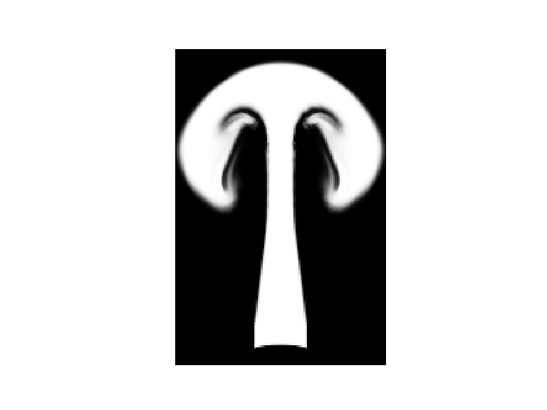
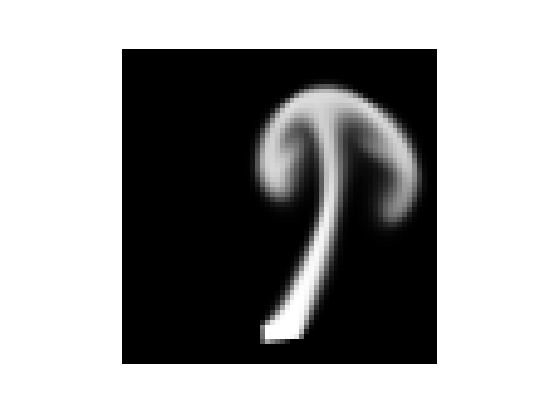
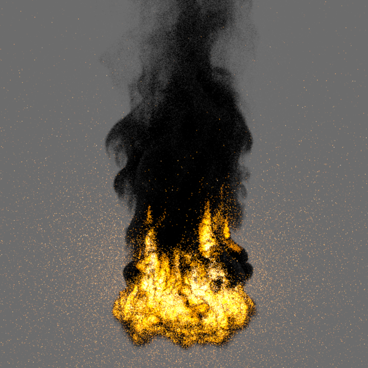
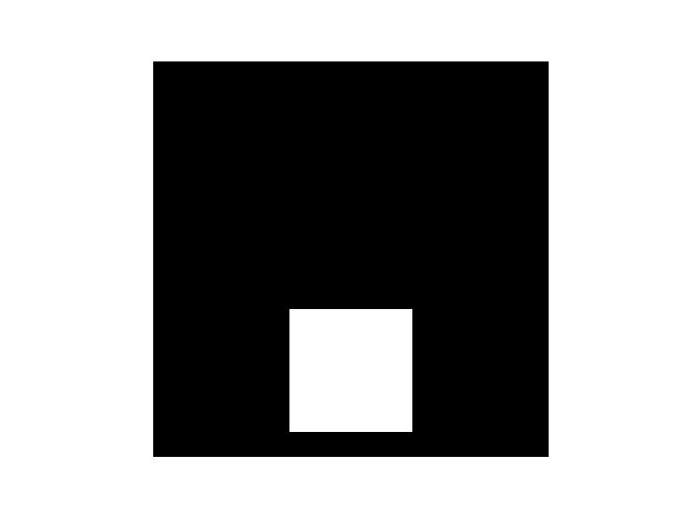

# Fluid Control
## Fluid Simulation
Implementation of fluid solver based on [PBS homework](https://gitlab.ethz.ch/yueliyue/pbs23) and [Shrunk Domain](https://gitlab.ethz.ch/cglsim/shrunk-domain-pytorch). Currently MacCormack is not working for optimization. 

## Fluid Control
Implementation of [adjoint method to control fluids](https://grail.cs.washington.edu/projects/control/fluidAdjoint.pdf), also partly referred to [Shrunk Domain](https://gitlab.ethz.ch/cglsim/shrunk-domain-pytorch). 

## Rendering
Volumetric path tracing for global illumination and delta tracking for heterogeneous participating media, implemented as course project for [computer graphics](https://cgl.ethz.ch/teaching/cg22/www-nori/index.html#project), based on [Nori 2](https://wjakob.github.io/nori-very-old/) and [PBRT](https://www.pbr-book.org). Can also be done very easily with blender. 

### Data format
Generated volumetric data are stored as `.vdb` files. Accessing density is done via [OpenVDB](https://www.openvdb.org) and [NanoVDB](https://www.openvdb.org/documentation/doxygen/NanoVDB_MainPage.html). It seems that OpenVDB cannot work directly with conda, and a workaround would be to copy the corrisponding `.so` file to the directory and use it as in `force2vdb.py`.

# Experiments
- Fluid simulation results can be obtained by running `test_solver.py`.

- 2D control results can be obtained by running `test_model.py`. Needs to store the target shape in advance. 

- 3D control results such as bunny to CRL can be obtained by running `crl_bunny_stream_reg.py`. `bunny.pt` is generated by downloading models from [OpenVDB](https://www.openvdb.org) and downsampling it to the needed resolution in python. `crl.pt` is generated in a similar way. 

